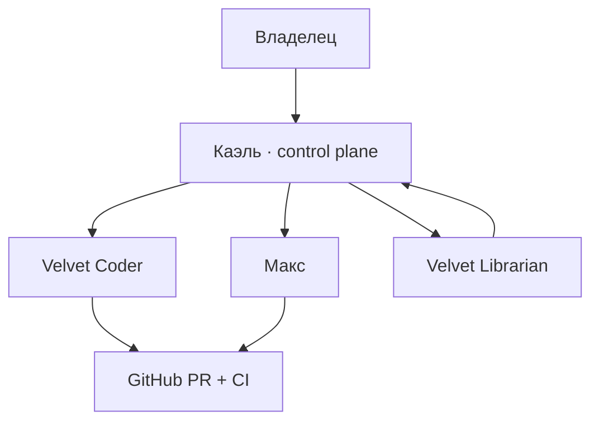

# Hermes Brain compiler

`context_compiler.py` проверяет versioned Markdown Vault и собирает отдельные
context packs для Каэля, Velvet Librarian, Velvet Coder и Макса.



Канонический Vault находится в `brain-vault/`. Корень репозитория можно открыть
в Obsidian; стартовая заметка — `brain-vault/Home.md`. `manifest.json` является
единственным registry источников, которые разрешено включать каждой сущности.

Компилятор:

- не обращается к сети;
- не читает `.env` и runtime directories;
- запрещает absolute paths, `..`, symlinks и secret-like значения;
- собирает стабильный `AGENTS.md`, не добавляя timestamp;
- создаёт `context-manifest.json` с SHA-256 каждого source/output;
- сохраняет memory только как seed, не перезаписывая живую память сам;
- копирует только объявленные skills конкретной сущности.

Codex-профили дополнительно получают `CODEX.AGENTS.md`, где в стабильном порядке
объединены SOUL, project contract, context/cache/memory policies и bounded seeds.
Installer активирует его как `$CODEX_HOME/AGENTS.md`, а skills — как
`$HOME/.agents/skills/<name>/SKILL.md`. Hermes-профиль получает отдельные
`SOUL.md`, `AGENTS.md`, skills и memory seed только при отсутствии живой памяти.

## Runtime paths

| Сущность | Активный контекст | Проверка |
|---|---|---|
| Каэль | `<VELVET_DATA_DIR>/hermes` | `entity=kael`, mode `hermes` |
| Velvet chat | `/srv/hermes-coders/data/velvet` | `entity=velvet-coder`, mode `hermes` |
| Velvet Codex | `/srv/hermes-coders/codex/velvet` | `entity=velvet-coder`, mode `codex` |
| Max chat | `/srv/hermes-coders/data/max` | `entity=max-coder`, mode `hermes` |
| Max Codex | `/srv/hermes-coders/codex/max` | `entity=max-coder`, mode `codex` |
| Librarian | `<VELVET_DATA_DIR>/hermes-librarian` | local deny-all installer smoke |

Каждый active pack содержит `context-manifest.json`. Preflight и live smoke
сравнивают role/project sentinels, size и SHA-256 активных файлов.

## Покрытие механик Hermes

| Механика | Реализация | Runtime-доказательство |
|---|---|---|
| Personality | отдельный `SOUL.md` каждой автономной сущности | active file + output hash |
| Project instructions | allowlisted sources в compiled `AGENTS.md` | entity/project sentinels |
| Context window | стабильный порядок и лимит 128 000 bytes на entity context | compiler fail-closed |
| Compression | `compression.enabled=true` во всех agent profiles | preflight/config smoke |
| Prefix cache | детерминированные packs без timestamps/session IDs | повторная byte-identical compilation |
| Short memory | runtime session/compression и orchestration ledger | task/run ID + terminal state |
| Long memory | Git-versioned Vault, seeds и reviewable proposals | PR/CI; live memory не перезаписывается |
| Profiles | отдельные Hermes data, Codex HOME и workspaces | role/hash cross-check |
| Skills | per-entity allowlist из manifest | managed skill manifest + hashes |
| Handoff | JSON schemas task/result/memory proposal | strict Codex output + ledger |
| Tool safety | access matrix и fixed gateways | preflight; Librarian deny-all smoke |

Намеренно не активируются: загрузка всего Vault в prompt, общая память разных
проектов, secrets в Markdown, произвольный tool discovery и превращение
request-scoped AI providers в автономных агентов.

Проверка Vault:

```bash
python deploy/hermes-brain/context_compiler.py validate
```

Сборка тестового context pack:

```bash
target="$(mktemp -d)"
python deploy/hermes-brain/context_compiler.py compile \
  --entity kael \
  --output "$target"
python deploy/hermes-brain/context_compiler.py verify \
  --entity kael \
  --pack "$target"
```

Runtime installation выполняют существующие fixed installers. Компилятор не
делает Git commit, deployment, restart или запись в production БД.

Проверка уже установленного pack:

```bash
python deploy/hermes-brain/verify_installed_context.py \
  --target /srv/hermes-coders/codex/velvet \
  --entity velvet-coder \
  --mode codex
```

Изменение знания проходит `memory proposal → проверка Каэлем → coder PR → CI →
merge`. Obsidian не заменяет task ledger, GitHub, runtime DB или secrets store.

## Документационная база

- Hermes: [SOUL.md](https://github.com/NousResearch/hermes-agent/blob/main/website/docs/user-guide/features/personality.md),
  [prompt assembly](https://github.com/NousResearch/hermes-agent/blob/main/website/docs/developer-guide/prompt-assembly.md),
  [compression и caching](https://github.com/NousResearch/hermes-agent/blob/main/website/docs/developer-guide/context-compression-and-caching.md),
  [memory](https://github.com/NousResearch/hermes-agent/blob/main/website/docs/user-guide/features/memory.md),
  [isolated profiles](https://github.com/NousResearch/hermes-agent/blob/main/website/docs/user-guide/profiles.md) и
  [configuration](https://github.com/NousResearch/hermes-agent/blob/main/website/docs/user-guide/configuration.md).
- Codex: [global/project AGENTS.md](https://learn.chatgpt.com/docs/agent-configuration/agents-md),
  [non-interactive output schema](https://learn.chatgpt.com/docs/non-interactive-mode)
  и [configuration reference](https://learn.chatgpt.com/docs/config-file/config-reference).
